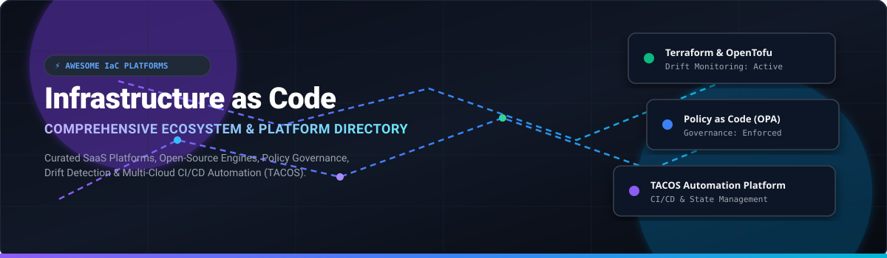

  
  
  
  
  
  
  

# 🚀 Awesome Infrastructure as Code (IaC) Platforms Ecosystem

> A curated directory of premier **SaaS platforms** and **open-source projects** for Infrastructure as Code (IaC) management, TACOS (Terraform Automation and Collaboration Software), state storage, drift detection, policy governance, and multi-cloud CI/CD orchestration.

---

## 📌 Table of Contents
- [🌐 Market Overview & Insights](#-market-overview--insights)
- [☁️ SaaS / Hosted IaC Platforms](#️-saas--hosted-iac-platforms)
- [🔓 Open-Source GitHub Projects](#-open-source-github-projects)
- [💡 Architectural Guidance](#-architectural-guidance)
- [🤝 How to Contribute](#-how-to-contribute)
- [📈 Star History](#-star-history)
- [💖 Support & Community](#-support--community)
- [⚠️ Disclaimer](#️-disclaimer)

---

## 🌐 Market Overview & Insights

> [!NOTE]
> **Market Size & Structure:** The global Infrastructure as Code (IaC) and Cloud Orchestration market is estimated at **$3.5 Billion in 2026** and projected to expand to **$9.8 Billion by 2030** (CAGR ~22%). The market is currently **moderately fragmented**: primary engine creators (AWS, IBM/HashiCorp) maintain control over base provisioning frameworks, while an aggressive ecosystem of enterprise TACOS vendors (Harness, Spacelift, env0, Scalr, Pulumi Cloud, Terramate) competes directly on drift governance, policy enforcement, developer self-service portals, and multi-cloud orchestration.

---

## ☁️ SaaS / Hosted IaC Platforms

The table below details commercial hosted platforms providing remote state, run triggers, RBAC, policy enforcement, and infrastructure drift monitoring. Entries are sorted by **Company Size (Valuation / Revenue) Descending**.

| Platform 🛠️ | Company Valuation / Revenue 🏢 | Starting Price 💵 | Free Tier / Trial Limits 🎁 | Key Capabilities ⚡ |
| :--- | :--- | :--- | :--- | :--- |
| **[AWS CloudFormation StackSets](https://aws.amazon.com/cloudformation/)** | **$1.8 Trillion** *(AWS Market Cap / ~$105B ARR)* | **$0.00** *(Native AWS templates; $0.0009 per handler operation past free allowance)* | **1,000 handler operations/mo free forever** per AWS account | Multi-account & multi-region stack deployments, automatic stack drift detection, native AWS IAM integration. |
| **[Harness IaC Management](https://www.harness.io/)** | **$3.7 Billion** *(Series D Valuation)* | **$100 / developer / month** *(Enterprise module pricing)* | **Free plan for up to 5 developers** & 2,000 build minutes/month | CI/CD pipeline integration, automated canary rollbacks, cost governance, OPA policy checks. |
| **[Terraform Cloud / HCP Terraform](https://www.hashicorp.com/products/terraform)** | **$6.4 Billion** *(Acquired by IBM)* | **$0.00014 / resource-hour** *(~$0.10 per resource-month)* | **Free forever up to 500 managed resources/mo** & 5 team users | HashiCorp managed state storage, Sentinel & OPA policy enforcement, private module registry. |
| **[Pulumi Cloud](https://www.pulumi.com/)** | **$400 Million** *(Series C Valuation)* | **$0.00025 / resource-hour** *(Team tier starting at $50/user/mo)* | **Free plan for individual developers** (up to 150 managed resources/mo) | State management for code-defined IaC (TS, Python, Go, C#), Pulumi ESC secrets management. |
| **[Spacelift](https://spacelift.io/)** | **$250 Million** *(Series B Valuation)* | **$250 / month** *(Starter plan with 2 concurrent workers)* | **14-day free trial** with unlimited features & 2,000 run minutes | Multi-IaC (Terraform, OpenTofu, Pulumi, CloudFormation, Ansible), OPA governance, stack dependencies. |
| **[env0](https://www.env0.com/)** | **$150 Million** *(Series B Valuation)* | **$199 / month** *(Starter plan, 2 concurrent deployments)* | **Free plan up to 3 users** & 100 deployments/mo (14-day trial available) | Self-service developer environments, cloud cost tracking, TTL auto-destruction, OPA support. |
| **[Cloudify](https://cloudify.co/)** | **$100 Million** *(Acquired by Dell Technologies)* | **$0.08 / node-hour** *(Managed cloud orchestration)* | **30-day free trial** with up to 10 node deployments | Hybrid multi-cloud environment orchestration, TOSCA-based DSL, Kubernetes integration. |
| **[Scalr](https://scalr.com/)** | **$80 Million** *(Bootstrapped / ~$15M ARR)* | **$0.08 / run hour** *(Pay-as-you-go flex pricing)* | **Free plan up to 50 runs/mo** & 5 environment workspaces | Terraform & OpenTofu orchestration, hierarchical structure, built-in OPA engine, drift detection. |
| **[Firefly](https://www.firefly.ai/)** | **$60 Million** *(Series A Valuation)* | **$300 / month** *(Pro plan for up to 100 cloud assets)* | **14-day free trial** scanning & codifying up to 250 assets | Cloud asset management, reverse IaC (codifying unmanaged infrastructure), automatic drift alerts. |
| **[Brainboard](https://www.brainboard.co/)** | **$30 Million** *(Series A Valuation)* | **$99 / user / month** *(Starter tier)* | **Free plan for 1 user**, 2 architectures, and export capability | Visual cloud architecture design to Terraform code generation, diagram sync. |
| **[StackGen](https://www.stackgen.com/)** | **$25 Million** *(AppVia Series A Valuation)* | **$150 / team / month** *(Team plan)* | **14-day free trial** with 5 workspace blueprints & AI generation | AI-assisted IaC generation, policy enforcement, architectural governance blueprints. |
| **[Digger Cloud](https://digger.dev/)** | **$15 Million** *(YC Backed Valuation)* | **$49 / month** *(Organization cloud tier)* | **Free forever tier** for open-source & up to 5 repos (unlimited PR runs) | In-CI Terraform/OpenTofu PR orchestration (GitHub Actions / GitLab CI), zero state access. |
| **[Terramate Cloud](https://terramate.io/)** | **$12 Million** *(Seed Valuation)* | **$29 / user / month** *(Team plan)* | **Free plan up to 3 users** & 50 stack syncs/month | Code generation engine, drift detection visualization, asset inventory dashboards. |
| **[Massdriver](https://www.massdriver.cloud/)** | **$10 Million** *(Seed Valuation)* | **$70 / user / month** *(Pro tier)* | **Free plan for single developer** with up to 3 cloud environments | Platform engineering UI, visual cloud deployment canvas, operational telemetry sync. |

---

## 🔓 Open-Source GitHub Projects

Below are top open-source engines, CLI tools, wrappers, scanners, and pull-request bots. Repositories are sorted by **GitHub Stars_Count Descending**.

1. ⭐ **[LocalStack](https://github.com/localstack/localstack)**   
   Fully functional local AWS cloud stack for offline IaC testing & local cloud development.

2. 📜 **[HashiCorp Terraform](https://github.com/hashicorp/terraform)**   
   The pioneer declarative multi-cloud infrastructure provisioning engine.

3. 🛡️ **[Trivy](https://github.com/aquasecurity/trivy)**   
   Comprehensive security scanner for container images, file systems, Git repos, and IaC templates.

4. 🍲 **[OpenTofu](https://github.com/opentofu/opentofu)**   
   Linux Foundation community-driven, truly open-source fork of Terraform under the MPL 2.0 license.

5. 🟪 **[Pulumi Engine](https://github.com/pulumi/pulumi)**   
   Open-source SDK to define infrastructure using TypeScript, Python, Go, C#, Java, and YAML.

6. ⚖️ **[Open Policy Agent (OPA)](https://github.com/open-policy-agent/opa)**   
   CNCF policy-as-code engine for unified governance across IaC plans, API gateways, and Kubernetes.

7. 🐙 **[Crossplane](https://github.com/crossplane/crossplane)**   
   CNCF control plane framework extending Kubernetes to manage cloud services and infrastructure resources.

8. 🚜 **[Terragrunt](https://github.com/gruntwork-io/terragrunt)**   
   Thin CLI wrapper that keeps Terraform/OpenTofu configurations DRY, working with multiple modules and environments.

9. 🔱 **[Atlantis](https://github.com/runatlantis/atlantis)**   
   Terraform & OpenTofu pull request automation webhooks for GitHub, GitLab, and Bitbucket workflows.

10. 🔍 **[Checkov](https://github.com/bridgecrewio/checkov)**   
    Static code analysis tool for infrastructure-as-code (Terraform, CloudFormation, Bicep, Helm).

11. 📦 **[CDKTF (Cloud Development Kit for Terraform)](https://github.com/hashicorp/terraform-cdk)**   
    Defines Terraform infrastructure using programming languages like TypeScript, Python, Java, C#, and Go.

12. 🪄 **[Terramate CLI](https://github.com/terramate-io/terramate)**   
    Open-source tool for managing code generation, change detection, and execution in multi-stack IaC repos.

13. ⛏️ **[Digger Engine](https://github.com/diggerhq/digger)**   
    Open-source IaC orchestrator that runs Terraform/OpenTofu inside existing CI runners (GitHub Actions/GitLab).

14. 🎯 **[KusionStack (Kusion)](https://github.com/KusionStack/kusion)**   
    Intent-driven cloud-native application delivery and infrastructure orchestration engine.

15. 🌾 **[Farmer](https://github.com/CompositionalIT/Farmer)**   
    F# domain-specific language for generating Azure Resource Manager (ARM) and Bicep templates cleanly.

---

## 💡 Architectural Guidance

- **Open-Source Standard Stack**: Combine **OpenTofu** (provisioning) + **Terragrunt** / **Terramate** (DRY architecture) + **Atlantis** / **Digger** (PR automation) + **OPA / Checkov / Trivy** (security policy scanning).
- **Enterprise Control Plane**: Leverage **HCP Terraform**, **Spacelift**, **env0**, or **Scalr** when enterprise features like single sign-on (SSO), RBAC, audit trails, drift detection, and centralized state storage are mandatory.
- **Kubernetes-Native Infrastructure**: Use **Crossplane** or **Pulumi** when infrastructure provisioning needs to align directly with application deployment loops and developer APIs.

---

## 🤝 How to Contribute

1. Fork this repository.
2. Add or update entries in `README.md` following the tabular or badged structure.
3. Ensure all links point to official documentation or source code repos.
4. Open a Pull Request with a clear description of changes.

Check out our curated ecosystem list: [Awesome Awesome Awesome](https://github.com/ishandutta2007/Awesome-Awesome-Awesome).

---

## 📈 Star History

---

## 💖 Support & Community

Thank you for exploring **Awesome Infrastructure-As-Code Platform**! If this repository has helped you evaluate, select, or automate your cloud infrastructure toolchain, please consider supporting the project:

- 🌟 **Star this repository** to help others discover it on GitHub.
- 🔀 **Fork & Contribute** to submit new IaC tools, feature updates, or corrections.
- 📢 **Share** with your platform engineering, DevOps, and SRE networks.
- ☕ **Buy me a coffee**: If you find this resource valuable, you can sponsor the maintainer on [GitHub Sponsors](https://github.com/sponsors/ishandutta2007).

  

---

## ⚠️ Disclaimer

This list is community-curated for informational purposes only. Misconfiguration of infrastructure tools can result in downtime or security risks. Validate all tools and security configurations prior to production deployment.
